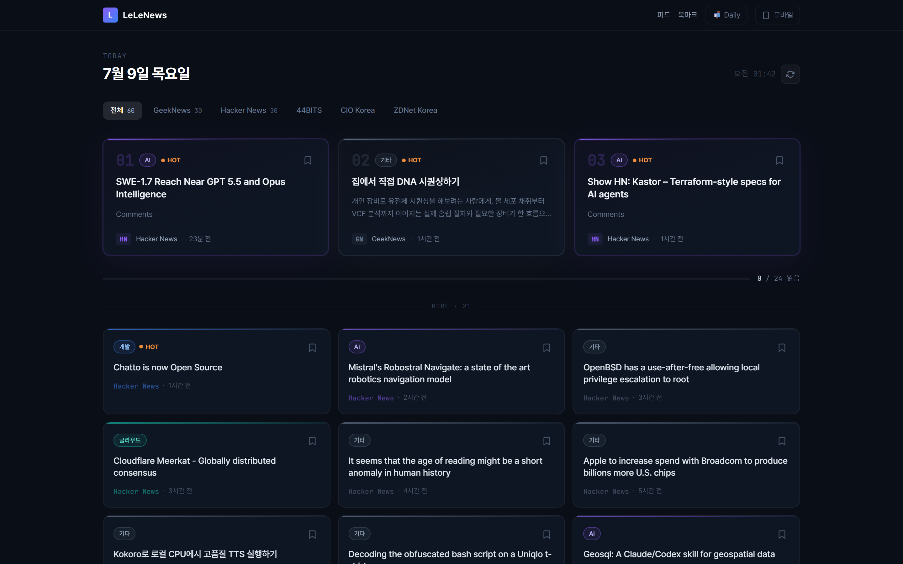

# LeLeNews

> 매일 아침 보는 개인 IT/개발 뉴스 대시보드

RSS 소스를 모아 한 화면에서 훑어보는 개인용 IT/개발 뉴스 허브. 더 큰 워크 대시보드의 뉴스 위젯으로 편입될 수 있게 모듈형으로 설계.



## 스택

- Next.js 14 (App Router) · React 18 · TypeScript
- TailwindCSS · `rss-parser`

## 핵심 기능

- RSS 5개 소스(GeekNews · Hacker News · 44BITS · CIO Korea · ZDNet) 서버사이드 병렬 파싱
- 한 소스 실패해도 나머지 정상 표시 (graceful skip)
- 키워드 기반 카테고리 자동 분류 (AI/보안/개발/클라우드/스타트업/기타)
- 페이지 포커스 복귀 시 5분 경과하면 자동 갱신

## 기술 포인트

- 다크 테마 디자인 시스템 (Pretendard + JetBrains Mono, 카테고리별 컬러)
- 히어로(최신 3개) + 카드 그리드(최대 21개) 레이아웃, RSS 실이미지 추출 + fallback
- 카드 순차 등장 애니메이션 (stagger slide-up)

## 로컬 실행

```bash
npm install
npm run dev
```

환경변수가 필요한 경우 `.env.local`에 설정하며, gitignore 처리되어 저장소에 포함되지 않는다.
